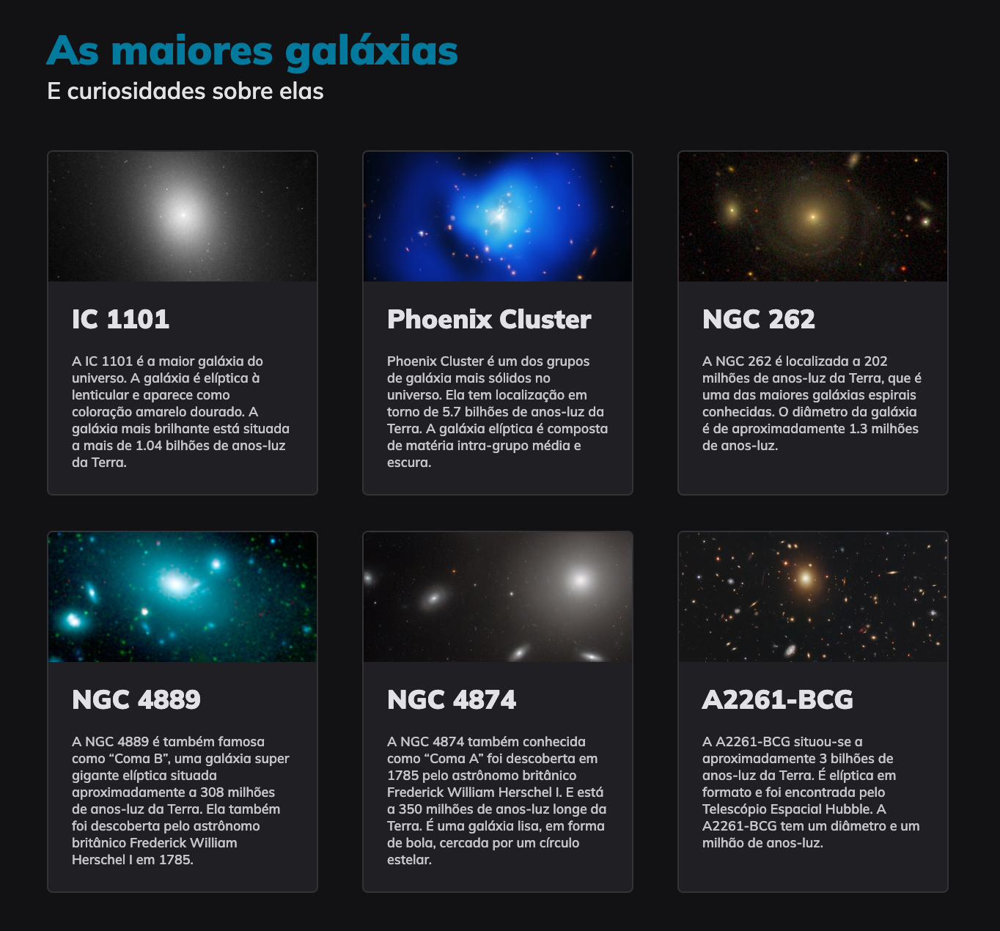

#  🪐 Galáxias • Projeto Explorer (Community) 🌌
🇺🇸 _Galaxies • Explorer Challenge (Community)_

## 👩🏻‍💻 Sobre este site

🇧🇷 Este projeto das Galáxias, me permitiu atuar mais com os conceitos teóricos apresentados nas aulas anteriores, colocando na prática, os coneitos de Grid.  

## 👩🏻‍💻 _About this website_ 
🇺🇸 _This Galaxies project allowed me to work more with the theoretical concepts presented in previous classes, putting Grid concepts into practice._

# 📸 Screenshot 

# 🚀 Techologies
🇧🇷 Esse projeto foi desenvolvido com as seguintes tecnologias: 

🇺🇸 This project was developed with the following technologies: 

- [HTML](../index.html)
- [CSS](../style.css)
- [Git e Github](https://github.com/)
- [Figma](www.figma.com)
- [Rocketseat](www.rocketseat.com.br)

##

- 🔗 **[Online project](../index.html)**

##
🗓️ Jan. 2024

## 
                      ・Developed with ♡ by BM